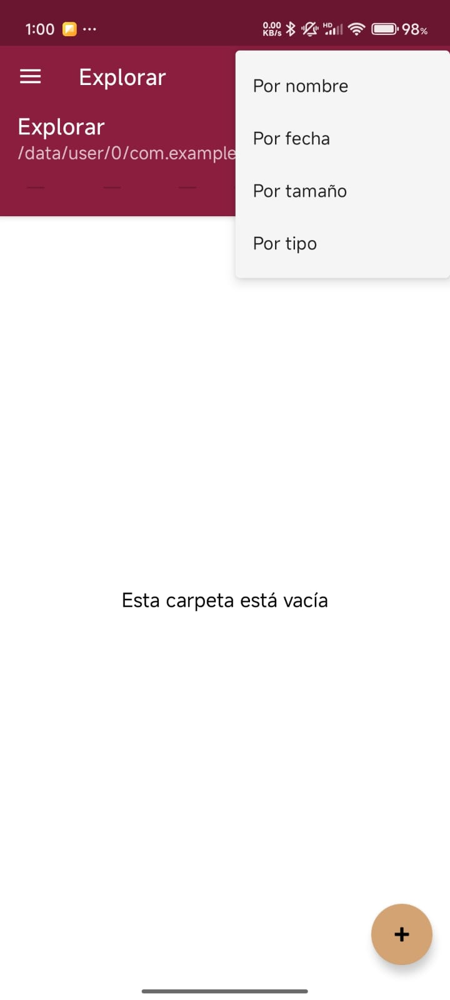
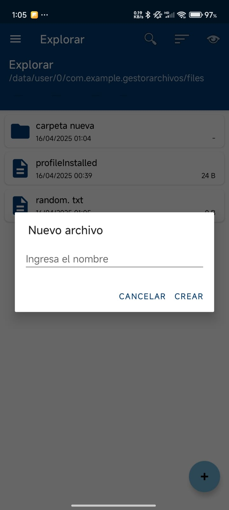

# GestorArchivos

## Descripción
GestorArchivos es una aplicación Android que permite explorar, gestionar y visualizar archivos en el dispositivo. Desarrollada como parte de un proyecto educativo para el IPN (Instituto Politécnico Nacional), esta aplicación ofrece funcionalidades para navegar por el sistema de archivos, visualizar diferentes tipos de archivos, y administrar favoritos y recientes.

## Características principales
- Exploración de archivos en almacenamiento interno y externo
- Visualización de distintos tipos de archivos (texto, imágenes, JSON, XML)
- Historial de archivos recientes
- Sistema de favoritos
- Opciones de ordenamiento y visualización
- Múltiples temas (Guinda-IPN y Azul-ESCOM)
- Operaciones básicas de archivos (crear, renombrar, copiar, mover, eliminar)

## Requisitos del sistema
- Android 8.0 (API 24) o superior
- Espacio mínimo: 10MB
- Permisos de almacenamiento

## Instalación

### Desde Android Studio
1. Clona el repositorio:
   ```
   git clone https://github.com/tu-usuario/GestorArchivos.git
   ```
2. Abre el proyecto en Android Studio
3. Sincroniza el proyecto con los archivos Gradle
4. Conecta un dispositivo Android o configura un emulador
5. Haz clic en "Run" (▶️) para compilar e instalar la aplicación

### APK directamente
1. Descarga el archivo APK desde la sección de releases
2. En tu dispositivo Android, ve a Configuración > Seguridad
3. Activa "Orígenes desconocidos" para permitir la instalación de aplicaciones fuera de Play Store
4. Encuentra el APK descargado y tócalo para instalar

## Estructura del proyecto

```
app/
├── src/
│   ├── main/
│   │   ├── java/com/example/gestorarchivos/
│   │   │   ├── activities/           # Actividades principales
│   │   │   ├── adapters/             # Adaptadores para RecyclerViews
│   │   │   ├── data/                 # Modelos de datos y persistencia
│   │   │   ├── fragments/            # Fragmentos de la interfaz
│   │   │   ├── ui/theme/             # Definición de temas y estilos
│   │   │   └── viewmodels/           # ViewModels de la arquitectura MVVM
│   │   └── res/                      # Recursos de la aplicación
│   └── androidTest/                  # Pruebas instrumentadas
└── build.gradle.kts                  # Configuración de compilación
```

### Componentes principales

#### Activities
- **MainActivity**: Actividad principal con navegador lateral
- **FileViewerActivity**: Visualizador de archivos

#### Fragments
- **FileExplorerFragment**: Explorador de archivos
- **RecentFilesFragment**: Gestor de archivos recientes
- **HistoryFragment**: Historial de navegación
- **FavoritesFragment**: Archivos marcados como favoritos

#### Datos
- **FileItem**: Modelo que representa un archivo o directorio
- **RecentFile**: Modelo para archivos recientes
- **FileRepository**: Gestiona las operaciones con archivos
- **FileDatabase**: Base de datos local con Room

#### Adaptadores
- **FileAdapter**: Adaptador para la lista de archivos
- **BreadcrumbAdapter**: Adaptador para la ruta de navegación
- **RecentFileAdapter**: Adaptador para archivos recientes

## Uso

### Navegación principal
- **Explorar**: Navega por archivos y carpetas
- **Recientes**: Accede a archivos abiertos recientemente
- **Almacenamiento interno**: Explora el almacenamiento interno
- **Almacenamiento externo**: Explora el almacenamiento externo (requiere permisos)
- **Cambiar tema**: Alterna entre temas Guinda (IPN) y Azul (ESCOM)

### Explorador de archivos
- Toca un archivo para abrirlo
- Toca una carpeta para navegar dentro
- Usa la barra de migas (breadcrumbs) para navegación rápida
- Mantén presionado un elemento para mostrar opciones adicionales:
  - Abrir
  - Compartir
  - Renombrar
  - Copiar
  - Mover
  - Eliminar
  - Ver información
  - Añadir a favoritos

### Opciones de visualización
- Usa el menú de opciones para:
  - Buscar archivos
  - Ordenar por nombre, fecha, tamaño o tipo
  - Cambiar la visualización entre lista y cuadrícula

### Visor de archivos
- Visualización de formatos comunes:
  - Texto plano
  - Imágenes
  - JSON formateado
  - XML formateado
- Botón "Abrir con" para archivos no compatibles

## Permisos
La aplicación requiere los siguientes permisos:
- **Leer almacenamiento externo**: Para acceder a archivos en SD card
- **Escribir almacenamiento externo**: Para crear/modificar archivos

## Personalización
### Temas
La aplicación incluye dos temas:
- **Tema Guinda (IPN)**: Tema por defecto con colores institucionales del IPN
- **Tema Azul (ESCOM)**: Tema alternativo con colores de la ESCOM

Para cambiar el tema, abre el menú lateral y selecciona "Cambiar tema".

## Solución de problemas

### Problemas comunes
- **No se puede acceder al almacenamiento externo**: Verifica que la aplicación tenga permisos en Configuración > Aplicaciones > GestorArchivos > Permisos
- **Archivo no compatible**: Para formatos no soportados, usa el botón "Abrir con" para elegir otra aplicación

### Reportar problemas
Si encuentras algún problema, por favor reporta los detalles incluyendo:
- Modelo del dispositivo y versión de Android
- Descripción detallada del problema
- Capturas de pantalla si es posible

## Desarrollo

### Tecnologías utilizadas
- **Lenguaje**: Kotlin
- **Arquitectura**: MVVM (Model-View-ViewModel)
- **Componentes de Arquitectura**: ViewModel, LiveData, Room
- **UI**: Material Design, Navigation Component
- **Bibliotecas**:
  - Glide para carga de imágenes
  - PhotoView para zoom en imágenes
  - GSON para manejo de JSON
  - Simple XML para procesamiento XML

### Contribuir
1. Realiza un fork del repositorio
2. Crea una rama para tu funcionalidad (`git checkout -b nueva-funcionalidad`)
3. Realiza tus cambios y haz commit (`git commit -m 'Añadir nueva funcionalidad'`)
4. Sube tus cambios (`git push origin nueva-funcionalidad`)
5. Crea un Pull Request

## Equipo de desarrollo
- Desarrollado por estudiantes del IPN-ESCOM
- Contacto: [glongoria.3a.is@gmail.com]

## Capturas de Pantalla  
- **Permisos solicitados por la aplicación**


- **Pantalla principal de la aplicación**


- **Barra de busqueda**


- **Filtros de la aplicación**


- **Menu lateral de la aplicación**


- **Temas de la aplicación**


- **Creación de carpetas y archivos**




- **Pestaña de archivos recientes y favoritos**


  
- **Limpieza de historial**


- **Vistas de archivos**


## Agradecimientos
- A la comunidad Android por sus recursos y bibliotecas
- Al Instituto Politécnico Nacional y la Escuela Superior de Cómputo por su apoyo
